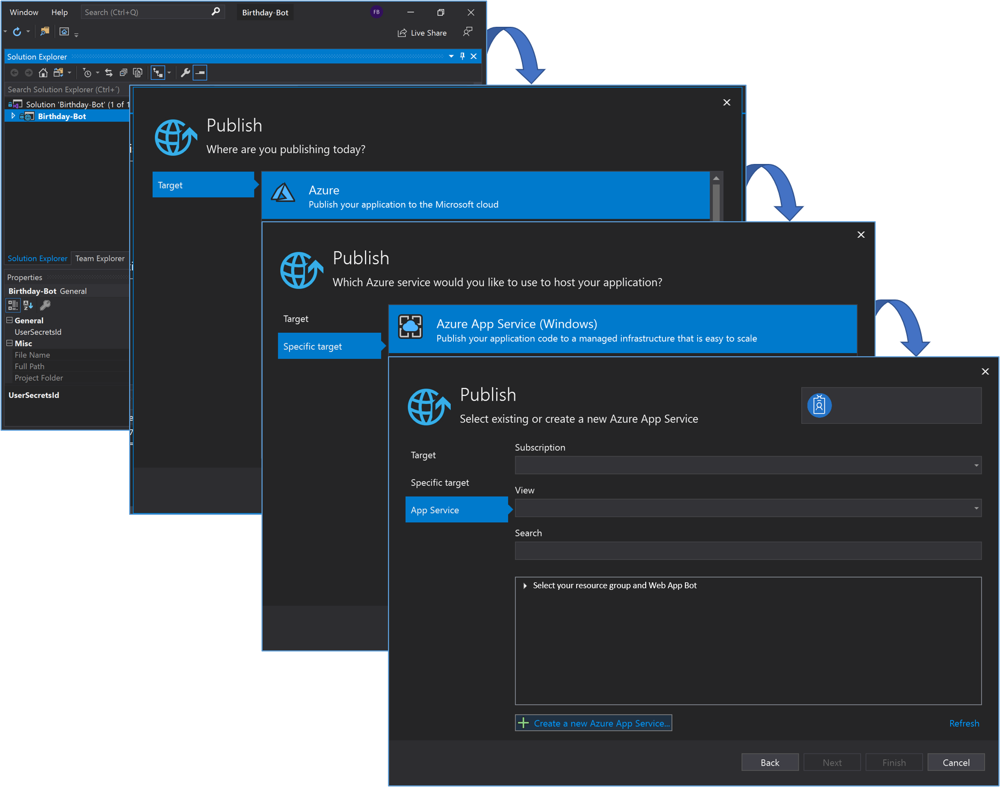
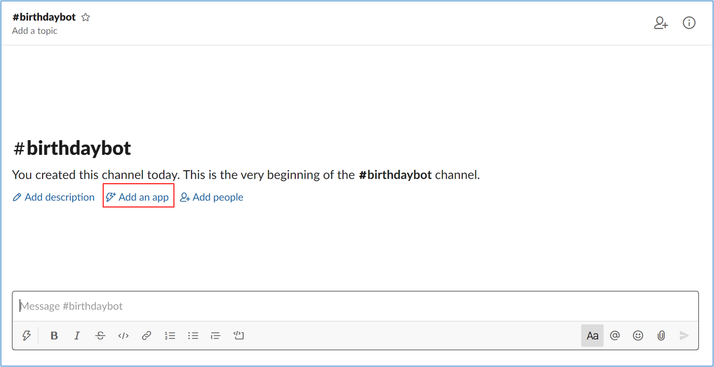
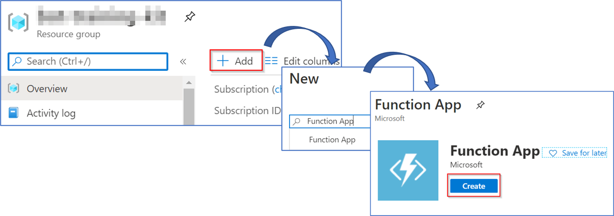
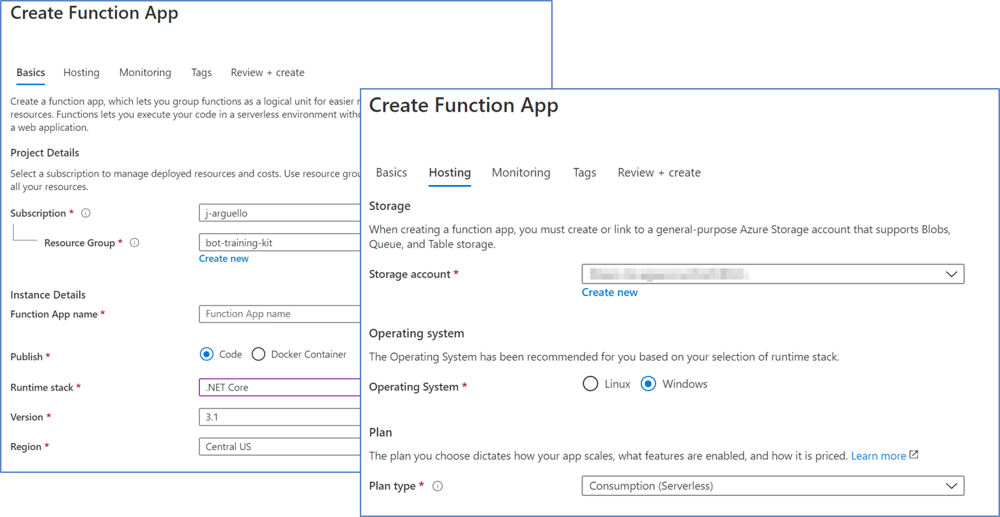
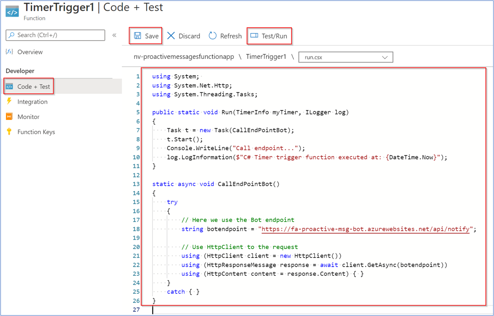
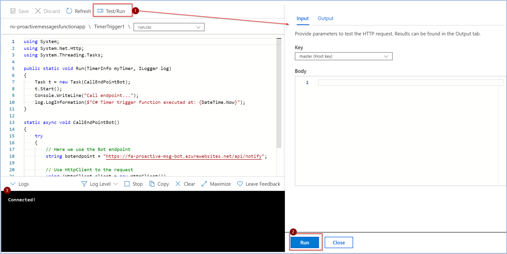
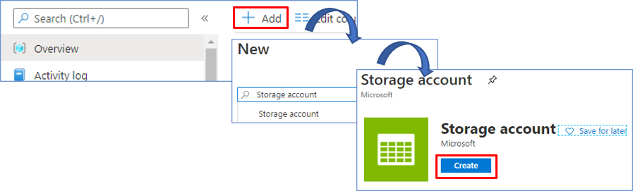
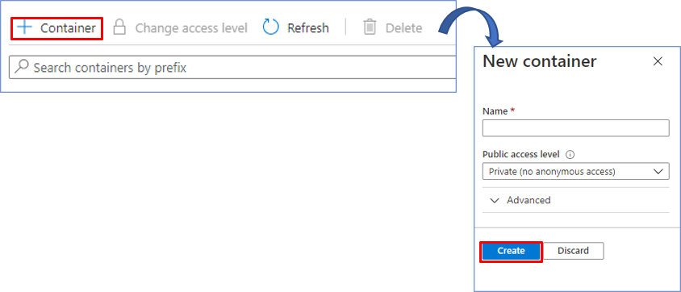
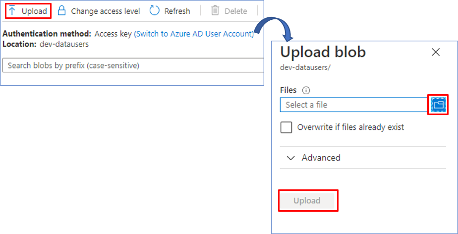

# Azure Bot SDK Happy Birthday Bot

Birthday-Bot is a bot that automatically sends birthday greetings to people through a Slack Channel.

### Pre-requisites

1. Proactive-Bot running
2. Azure Portal account
3. Slack Workspace (maybe a link to the sample Slack Channels)
4. [Web App Bot](https://github.com/southworks/bot-framework-labs/tree/birthday-bot/master/dotnet/09a.azure-wap#readme)

### Step by step

* Deploy **proactive-bot** on **Azure Portal**

    

* [Connect deployed bot with Slack Channel](https://github.com/southworks/bot-framework-labs/tree/birthday-bot/master/dotnet/10a.channels-slack#readme)

* Add Slack-App to a channel

Select your channel and click on "add an app"

* Add **Function** to **Azure Function** on **Azure Portal**, **Run/Test**

    - Add new Function App into your Azure Portal Resource Group

    

    - Select the Subscription & Resource Group, **Function App Name**, Runtime stack, Version and Region, and then an Storage account with Windows Operating System
    
    

    - Once created the **function-app**, add a **new Function**, based on **Timer trigger Template**

    
    **Schedule** could be configure as the classic cronjob on linux.

    - After created the **function** with the template, edit and save the code to execute every tick of the timer

    

    - Then **Test/Run** the code and review the log to confirm it runs without problems.

    

* External data storage on **Azure Portal**

    - Add new Storage account into your Azure Portal Resource Group  

        

    - We select our Resource group. We write a name for the storage account. Leave the default settings.
Finally, we select Review + Create to review your storage account settings and create the account  

        

     - Once created the storage account, add a new Container. Enter a name, select in Public access level Private, and then click create.  

        

     - With the container created, we will upload the corresponding JSON files. We select the file and then click Upload. We repeat the process to upload the second file.  

        
      

# Functionality

## Set Up Specific Channel

Regarding the main funcionality of the bot, **Send Happy Birthday Message**, you may set up the related specific channel in the **appsettings.json** file variable **SpecificChannelID**

