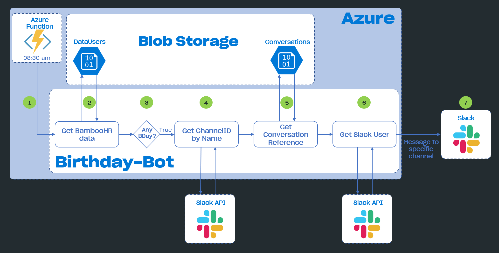

# Azure Bot SDK Happy Birthday Bot

This project aims to show you how to use the Bot Framework SDK to implement a proactive HappyBirthdayBot, integrating Azure Bot Service, Slack as a messaging channel, and BambooHR as a source of birthdates.

Before starting, these are some concepts you might want to be familiar with:

- [Azure Bot Service](https://docs.microsoft.com/azure/bot-service/) provides an integrated environment that is purpose-built for bot development.
- [Bot Framework SDK](https://docs.microsoft.com/azure/bot-service/bot-service-overview-introduction), along with the Azure Bot Service, provides tools to build, test, deploy, and manage intelligent bots, all in one place..
- [BambooHR](https://www.bamboohr.com/) is a technology company that provides human resources software as a service.
- [Slack](https://slack.com/) is a communication platform, mainly used by teams and enterprises.

## How it works

The Birthday Bot is an integration of Azure Bot Service with Slack. Its logic is based on Azure functions and Bot Framework SDK.

- **Sending proactive messages:** An Azure function is timer triggered upon schedule and send a request to the Bot's notify endpoint. It reads the configured channel in the `appsettings.json` file, the birthdays of the day from Blob Storage, and post it to the channel. The authentication tokens for Slack are also stored in the `appsettings.json` file.

### Architecture Diagram

## Getting Started

- [Configure Birthday Bot](docs/README.md).

## Contributing

- [See our contribution guidelines](./CONTRIBUTING.md)

## Further reading

- [Azure Functions](https://docs.microsoft.com/azure/azure-functions/)
- [Azure Blob storage](https://docs.microsoft.com/azure/storage/blobs/)