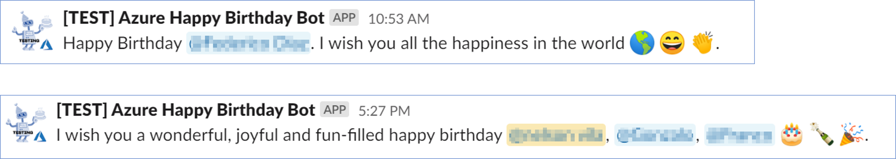

# Azure Bot SDK Happy Birthday Bot

This bot allows you to send a birthday greeting to users of a specific **Slack** channel. It is activated through an **Azure function** that allows triggering the bot in a set time (**cron expression**).

### Operation example

For more information on how to configure Birthday Bot go to [Configure Birthday Bot document](../docs/README.md).
