# Birthday Bot
## How to configure & deploy  
### Pre-requisites

1. [Azure Portal](https://portal.azure.com) account
1. [Slack Workspace](https://slack.com/get-started#/create)
1. The bot in this repository

### Create Slack App

* [Connect deployed bot with Slack Channel](https://docs.microsoft.com/en-us/azure/bot-service/bot-service-channel-connect-slack?view=azure-bot-service-4.0&tabs=abs)
* Add Slack-App to a channel
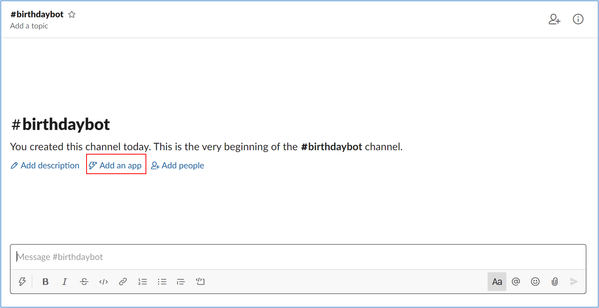
Select your channel and click on "Add an app"

### Configure blobstorage & container  
- In your browser, navigate to the [Azure Portal](https://portal.azure.com).
  
- Add new Storage account into your Azure Portal

    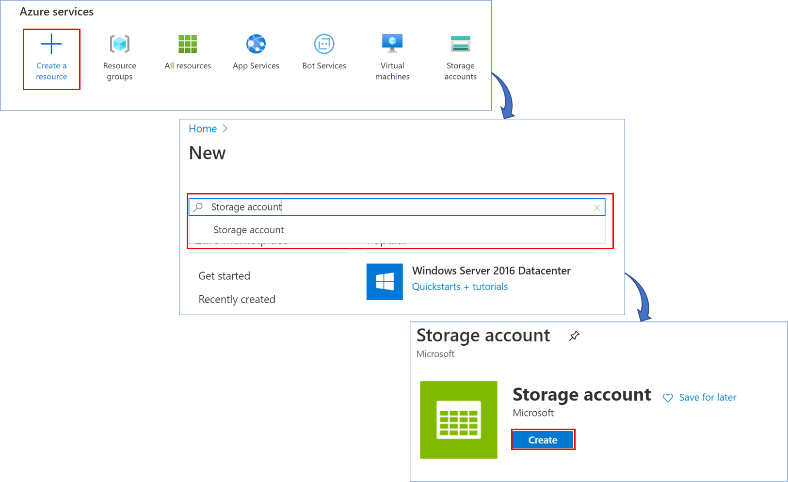

- We select our Resource group. We write a name for the storage account. Leave the default settings.
Finally, we select Review + Create to review your storage account settings and create the account.  
     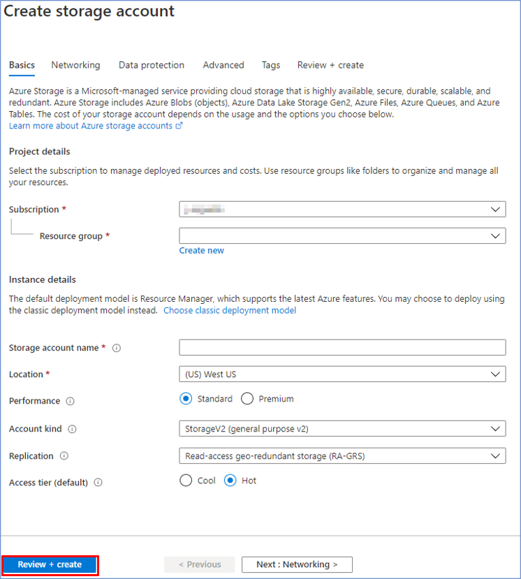

- Once created the storage account, add a new Container. Enter a name, select in Public access level Private, and then click create.  

     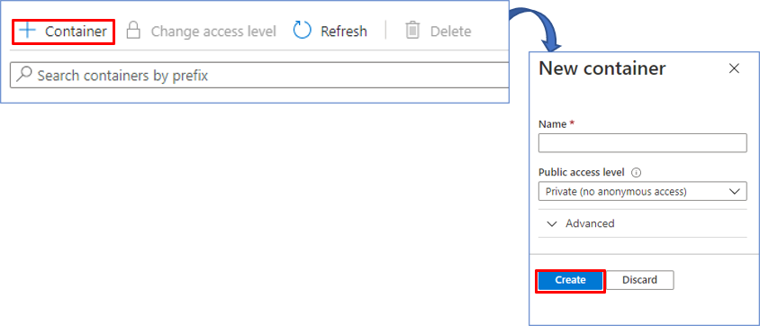

- With the container created, we will upload the corresponding JSON files. We select the file and then click Upload. We repeat the process to upload the second file.  

     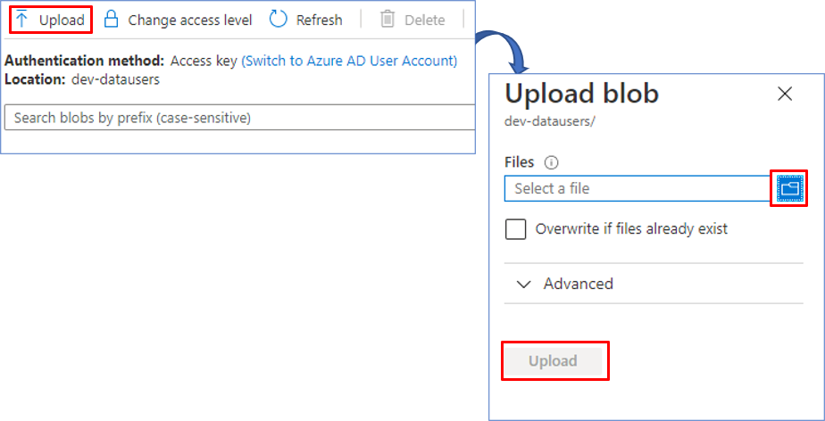

### Configure appsetting.json
**Set Up Specific Channel**

Regarding the main funcionality of the bot, **Send Happy Birthday Message**, you may set up the related **specific channel name** in the **appsettings.json** file variable **SpecificChannelName**. The channel ID is obtanined by its name to more easily specify the channel on which the bot should send the message. This channel name must be added under the SpecificChannelName parameter without the # character.

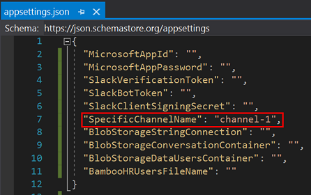  

**Set Up Slack App**

As for the connection to the slack app, the parameters (**SlackVerificationToken, SlackClientSigningSecret and SlackBotToken**) of the **appsetting.json** file of our project have to be modified.
- Enter the page of [Slack Api](https://api.slack.com/apps)
    - Select the app you want to connect to  
    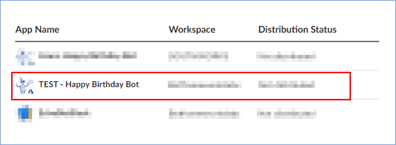

    - Set parameter **SlackVerificationToken** in **appsetting.json file**:
    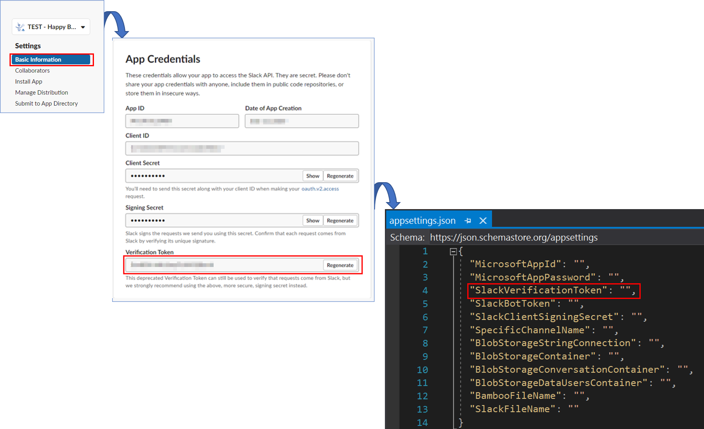

    - Set parameter **SlackClientSigningSecret** in **appsetting.json file**:
    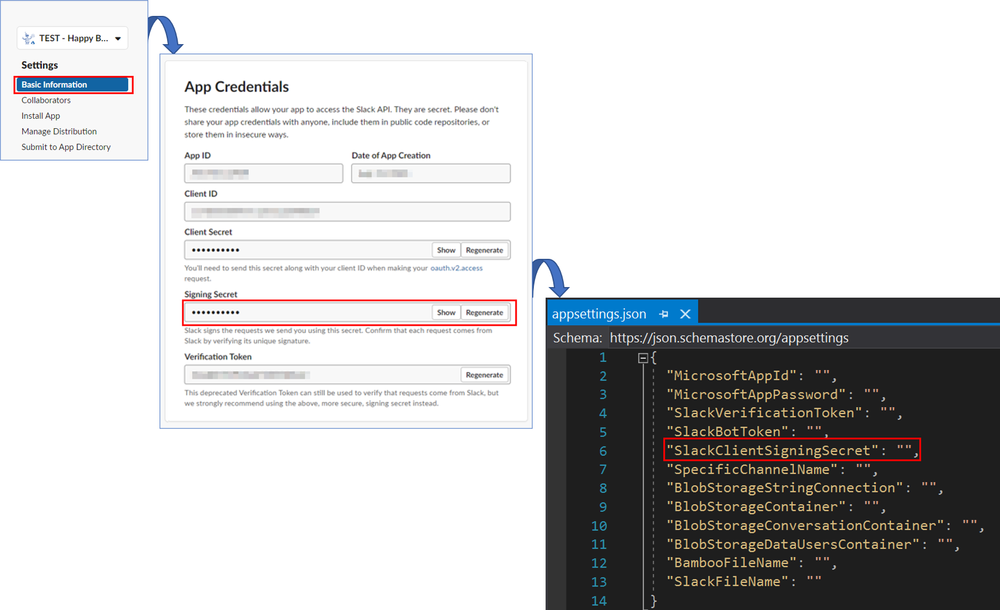

    - Set parameter **SlackBotToken** in **appsetting.json file**:
    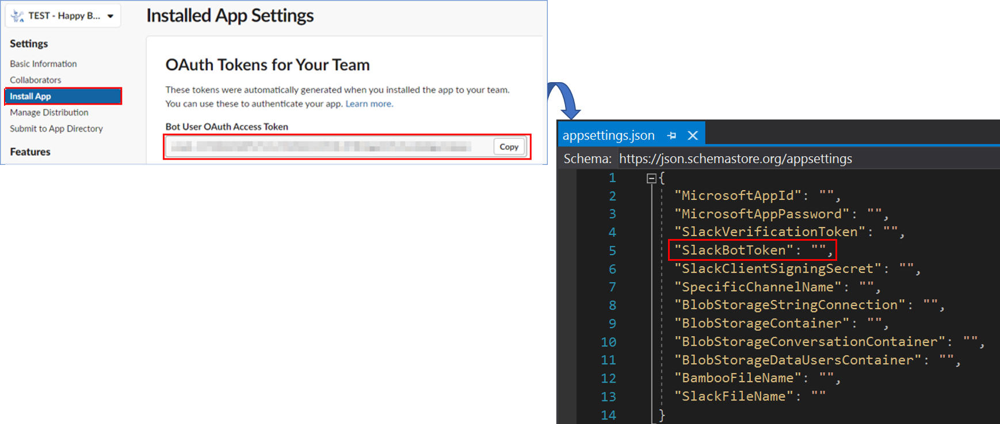

**Set up Azure Blob Storage**
 
As part of the configuration of the bot, we need to configure several parameters related to the **Blob Storage** in the **appsettings.json** file. The first thing would be to enter our **Storage Account** from the [Azure Portal](https://portal.azure.com/). To modify the following parameters:
 
- **Connection string** into variable **BlobStorageStringConnection**, it is a connection string to the Azure Blob Storage.
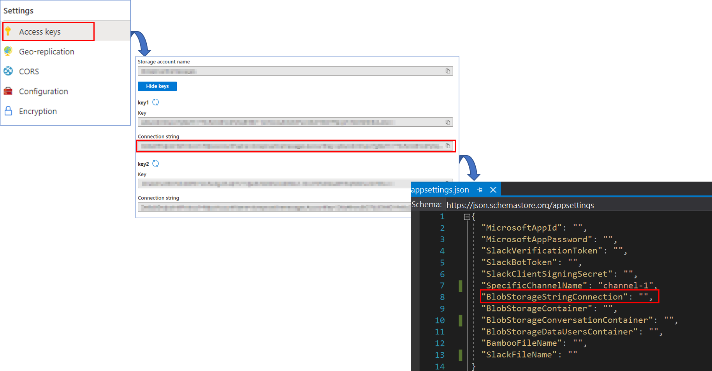
- **Data User Container** into variable **BlobStorageDataUsersContainer**, it is an url to the Azure Blob Storage Container.
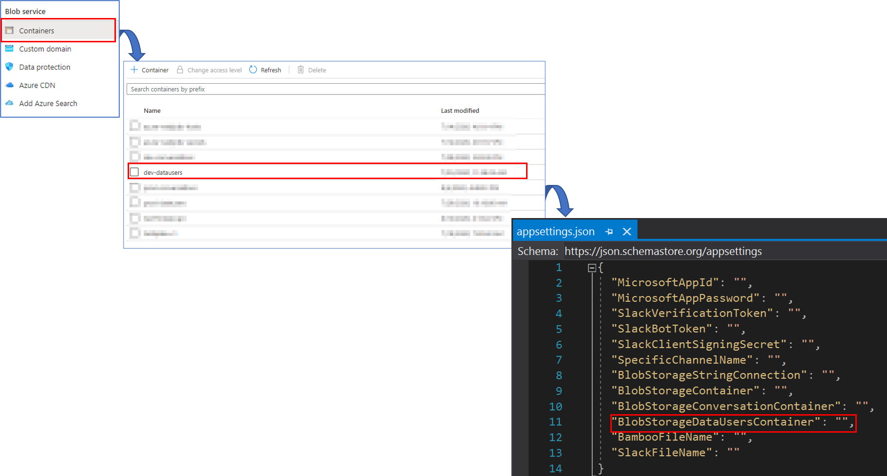
- **Conversation Container** into variable **BlobStorageConversationContainer**, it is an url to the conversation data.
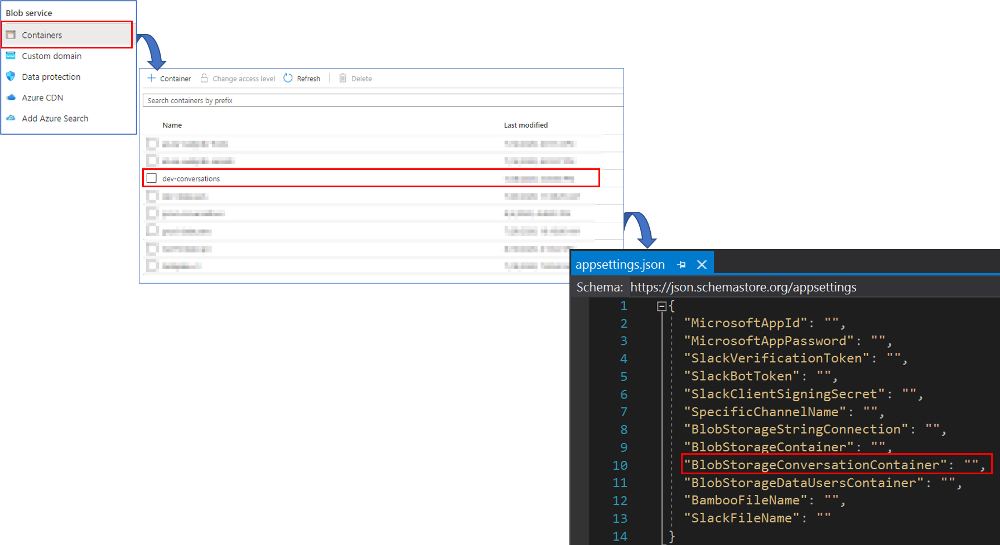

### Deploy on Azure Portal 

### Create Azure Function  
* Add **Function** to **Azure Function** on **Azure Portal**, **Run/Test**

    - Add new Function App into your Azure Portal Resource Group

    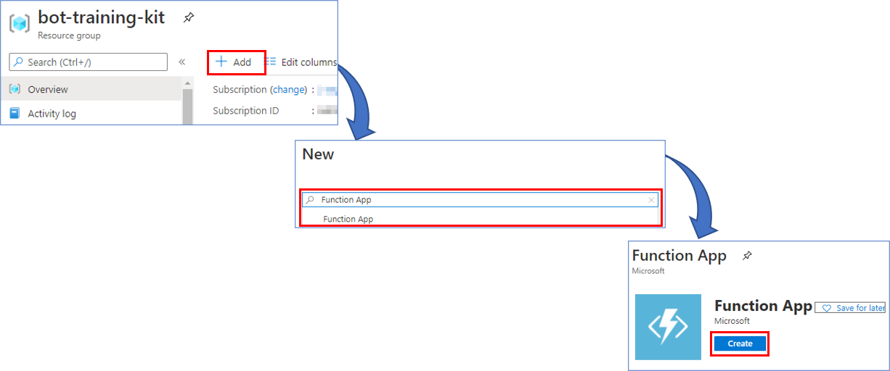

    - Select the Subscription & Resource Group, **Function App Name**, Runtime stack, Version and Region, and then an Storage account with Windows Operating System
    
    

    - Once created the **function-app**, add a **new Function**, based on **Timer trigger Template**

    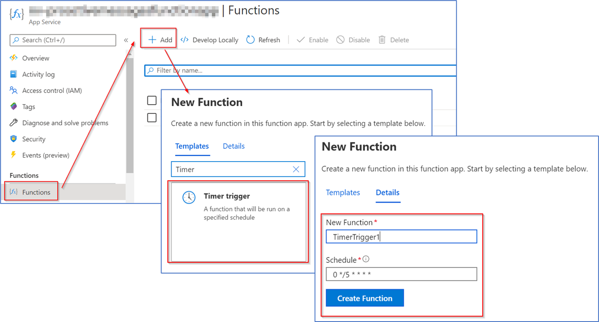
    **Schedule** could be configure as the classic cronjob on linux.

    - After created the **function** with the template, edit and save the code to execute every tick of the timer

    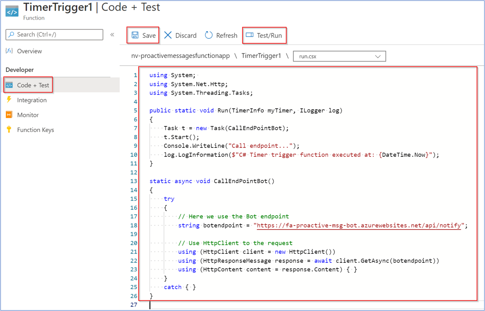

    - Then **Test/Run** the code and review the log to confirm it runs without problems.

    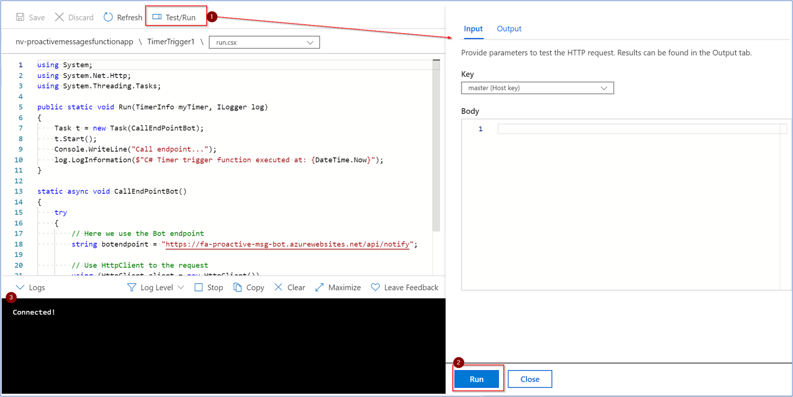

 ## [Integration](../../integrations#README.md)
