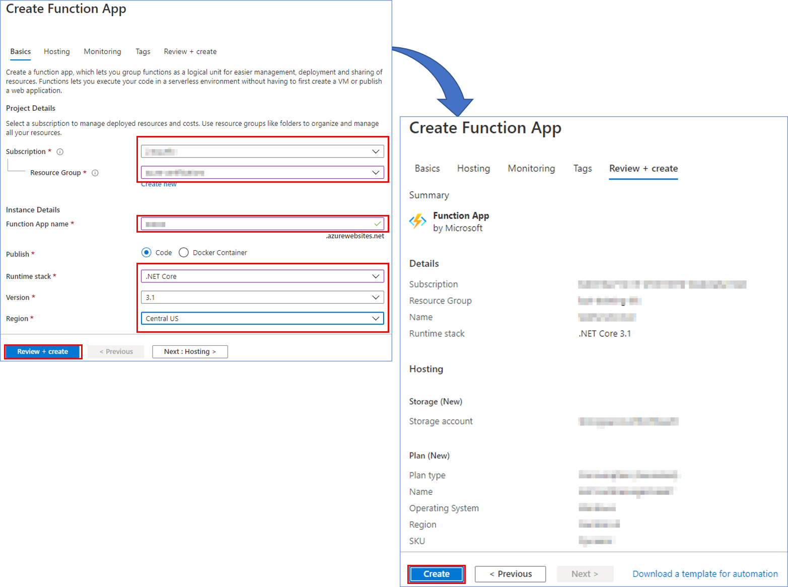

# Create Azure Function  
 - Add new Function App into your [Azure Portal](https://portal.azure.com/) Resource Group

    

1. Select **Subscription** and **Resource Group**.
1. Select and enter a **Function App Name**.
1. Select **Runtime Stack**, in this case C#.
1. Select Version and **Region**.
1. Then, click on **Review + Create**.
1. If validations are OK, click on **Create**.

    
    

 - Once created the **function-app**, add a **new Function**, based on **Timer trigger Template**

    
    **Schedule** could be configure as the classic cronjob on linux.
- After creating the function, we continue to create a **new application setting**.
    1. Enter into the **Configuration** option under the Settings section on the left panel.
    1. Enter the **New application setting** option.
    1. Then enter a **name** and **value** for our new application setting. In this case as a name we are going to add **bot_endpoint** and as a value we will enter the **endpoint** of our **App Service**.
    1. And we click on **Ok** to confirm the creation.
    1. Save the new configuration

    

- Then edit and save the code to execute every tick of the timer.   

    1. Enter the **Code + Test** option in the left panel
    1. Copy **the function code** and paste it in the code field.
    **Code**:
        ```
        using System;
        using System.Net.Http;
        using System.Threading.Tasks;

        public static void Run(TimerInfo myTimer, ILogger log)
        {
            Task t = new Task(CallEndPointBot);
            t.Start();
            Console.WriteLine("Call endpoint...");
            log.LogInformation($"C# Timer trigger function executed at: {DateTime.Now}"); 
        }

        static async void CallEndPointBot()
        {
            try
            {
                // Here we use the Bot endpoint
                string botendpoint = Environment.GetEnvironmentVariable("bot_endpoint", EnvironmentVariableTarget.Process);

                // Use HttpClient to the request
                using (HttpClient client = new HttpClient())
                using (HttpResponseMessage response = await client.GetAsync(botendpoint))
                using (HttpContent content = response.Content) { }
            }
            catch
            {
                log.LogInformation(ex.ToString());
            }
        }
        ```
    1. Click on **Save** to save the changes.


    

- Then **Test/Run** the code and review the log to confirm it runs without problems.

    

### Next Steps

* [BambooHR Integration](BambooHR.md#bambooHR-integration)