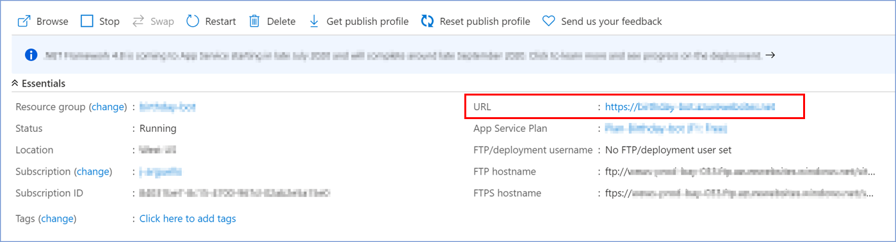
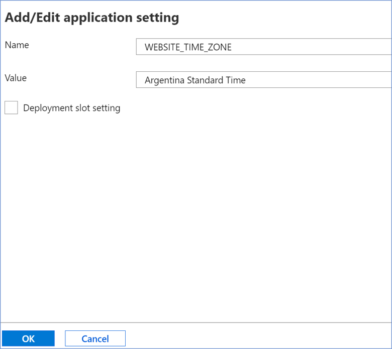
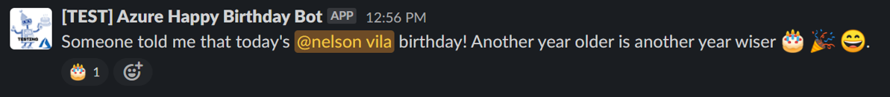

# Create Azure Function
This topic shows you how to create an Azure Functions in the Azure portal. Which allows us to trigger our bot to behave proactively in a specified time.. 

Add new Function App into your [Azure Portal](https://portal.azure.com/) Resource Group


1. Select **Subscription** and **Resource Group**.
1. Select and enter a **Function App Name**.
1. Select **Runtime Stack**, in this case .NET Core.
1. Select Version and **Region**.
1. Then, click on **Review + Create**.
1. If validations are OK, click on **Create**.

    
    

> When choosing the **location** for your new resource, remember to use the same region for all new resources to cut costs.

 Once created the **Azure Function**, add a **new Function**, based on **Timer trigger Template**


    **Schedule** could be configure as the classic [cronjob espression](https://docs.microsoft.com/en-us/azure/azure-functions/functions-bindings-timer?tabs=csharp#ncrontab-expressions).

After creating the function, we continue to create a **new application setting**.
1. Enter into the **Configuration** option under the Settings section on the left panel.
1. Enter the **New application setting** option.
1. Then enter a **name** and **value** for our new application settings. In this case as a name we are going to add **bot_endpoint** and as a value we will enter the **endpoint** of our bot we have deployed in the Azure Portal.
1. Go to your **Resource Groups**, then select the **Resource Group** where your bot is located, and select your **App Service** resource. There you can end the endpoint **URL**.
     
1. Copy the URL and add the following "/api/notify". Remaining as: **URL/api/notify**.
1. And we click on **Ok** to confirm the creation.
1. Save the new configuration

    

It is necessary to change the **TimeZone** of our **Azure Function** to be according to our need, for this we will repeat the previous steps of how to create a **new appication setting**, only that we must change the name of **WEBSITE_TIME_ZONE** and the value for our time zone (which we can search from this [link](https://docs.microsoft.com/en-us/windows-hardware/manufacture/desktop/default-time-zones)).  




Then edit and save the code to execute every tick of the timer.   

1. Enter the **Code + Test** option in the left panel
1. Copy **the function code** and paste it in the code field.  
**Code**:

    ```C#
    using System;
    using System.Net.Http;
    using System.Threading.Tasks;

    public static void Run(TimerInfo myTimer, ILogger log)

    {
        Task t = new Task(CallEndPointBot);
        t.Start();
        Console.WriteLine("Call endpoint...");
        log.LogInformation($"C# Timer trigger function executed at: {DateTime.Now}");
    }

    static async void CallEndPointBot()

    {
        try
        {
            // Here we use the Bot endpoint
            string botendpoint = Environment.GetEnvironmentVariable
            ("bot_endpoint", EnvironmentVariableTarget.Process);
            // Use HttpClient to the request
            using (HttpClient client = new HttpClient())
            using (HttpResponseMessage response = await client.GetAsync(botendpoint))
            using (HttpContent content = response.Content) { }
        }
        catch (Exception e)
        {
            Console.WriteLine(e.ToString());
        }
    }
    ```
1. Click on **Save** to save the changes.


      

Then **Test/Run** the code and review the log to confirm it runs without problems.


In our **Slack channel**, we can see that the Bot sent the greeting.




[← Back to Table of contents](README.md#table-of-contents)
