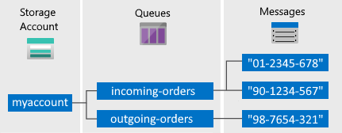

# Azure Queue
Queue storage gives you asynchronous message queueing for communication between application components, whether they are running in the cloud, on the desktop, on-premises, or on mobile devices.

## Features
- Simple, inexpensive, and durable message queuing for large workloads.
- Rich client libraries for .NET, Java, Android, C ++, Node.js, PHP, Ruby, and Python.
- Data accessible through the REST API.
- Maximum message size 64kb.
 (It's 64,000 characters. Since the average word in English is 4.7 characters, that allows up to 13,617 words.)
- Maximum time a message can remain in a queue is 7 days.
- Possibility so that the message does not expire adding -1 (setting the ``messagettl=<int-seconds>`` parameter).
- The capacity to store messages depends on the Storage Account chosen.

## Components of a Queue

- **Storage Account**: All access to Azure Storage is done through a storage account. For more information about storage accounts, see [Storage account overview](https://docs.microsoft.com/en-us/azure/storage/common/storage-account-overview).
- **Queue**: A queue contains a set of messages. All messages must be in a queue. Note that the queue name must be all lowercase. For information on naming queues, see [Naming Queues and Metadata](https://docs.microsoft.com/en-us/rest/api/storageservices/Naming-Queues-and-Metadata).
- **Message**: A message, in any format, of up to 64 KB. The maximum time that a message can remain in the queue is 7 days. For version 2017-07-29 or later, the maximum time-to-live can be any positive number, or -1 indicating that the message doesn't expire. If this parameter is omitted, the default time-to-live is seven days.
- **URL format**: Queues are addressable using the following URL format: ``http://your-storage-account.queue.core.windows.net/your-queue-name``.

## To implement this service

### Prerequisites
- A Storage Account created.
- Have the necessary packages installed:
    - Azure.Storage.Queues
    - Azure.Storage.Common
    - Azure.Core
    - System.Configuration.ConfigurationManager

### Add parameters to the appsettings.json file
You need to define two new parameters in the appsettings.json file for the connection with Azure Queue:
- **QueueStorageStringConnection**: Support using a storage connection string to configure endpoints and credentials for accessing storage services. To view your storage account credentials:
    
    1. Navigate to the [Azure portal](https://portal.azure.com/).
    1. Locate your storage account.
    1. In the **Settings** section of the storage account overview, select **Access keys**. Your account access keys appear, as well as the complete connection string for each key.
    1. Find the **Connection string** value under **key1**, and click the **Copy** button to copy the connection string. You will add the connection string value to an environment variable in the next step.
    
- **QueueName**: you must define the name that would be assigned to the Queue.

After having set these settings, our bot in addition to sending the greetings to a **Slack channel** will also be sent to a **Queue** to be stored.

- **EnabledNotifications**: This parameter defines the array of destinations where the message will be sent.
    - ``Slack``: this value indicates that the message will be sent to the configured **Slack channel**.
    - ``Queue``: this value indicates that the message will be sent to the previously configured **Queue**.
    
    Example:

    
    > In the example you can see that the parameter has both values set (**Slack** and **Queue**), which indicates that the message will be sent to the 2 destinations. It should be clarified that this parameter can also be set with **just one** of these values.

[← Back to Table of contents](README.md#table-of-contents)