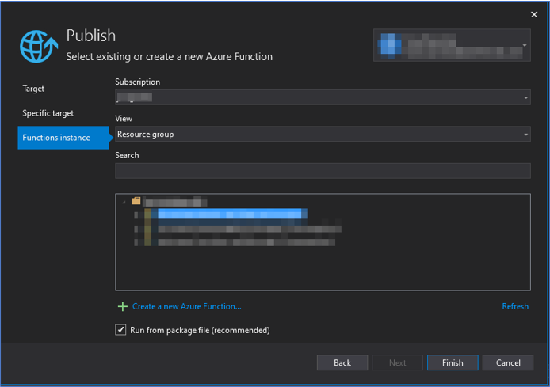
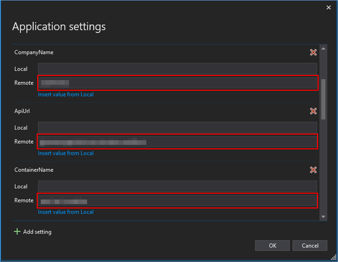
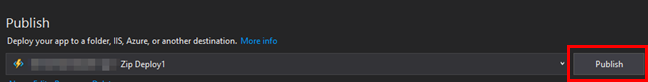

# BambooHR Integration

This document explains how to configure an Azure Function in order to retrieve birthdays information from BambooHR.

### Pre-requisites

1. [Azure Portal](https://portal.azure.com/) account
1. Knowledge configuring Azure Functions
1. [Azure Function code](https://github.com/southworks/azure-botsdk-happybirthday-bot/tree/azure-functions/bamboohrapi/azure-functions/DataIngestionBambooAPI)

### Set-up an Azure Function

1. Open the solution with Microsoft Visual Studio Community 2019.
1. Right-click on the Project name, and then in Publish.
1. In the wizard select Azure, select Azure Function App (Windows) and click on next
1. In the Functions Instances tab, select your existing Azure Function App. Then, click on Finish. If you don't have one, click on Create a New Azure Function.

    

1. Click on Manage Azure App Service settings, complete the following remote parameters. Then, click on OK
    - BambooApiKey: **your bambooHR ApiKey**
    - AzureWebJobsStorage: enter the **Storage Account connection string**, you can find it here BambooHR BlobStorage Connection String.
    - CompanyName = **your-company-name**
    - ContainerName = **your-azure-blobstorage-container**
    - ApiUrl = **api.bamboohr.com**

    

1. Finally, publish the Azure Function, clicking in the Publish Button.

    

1. After published, the Azure Function will be on your Resource Group. We recommend you to trigger it, anyway the Function will execute every day at 1.30am PST.

[← Back to Table of contents](README.md#table-of-contents)