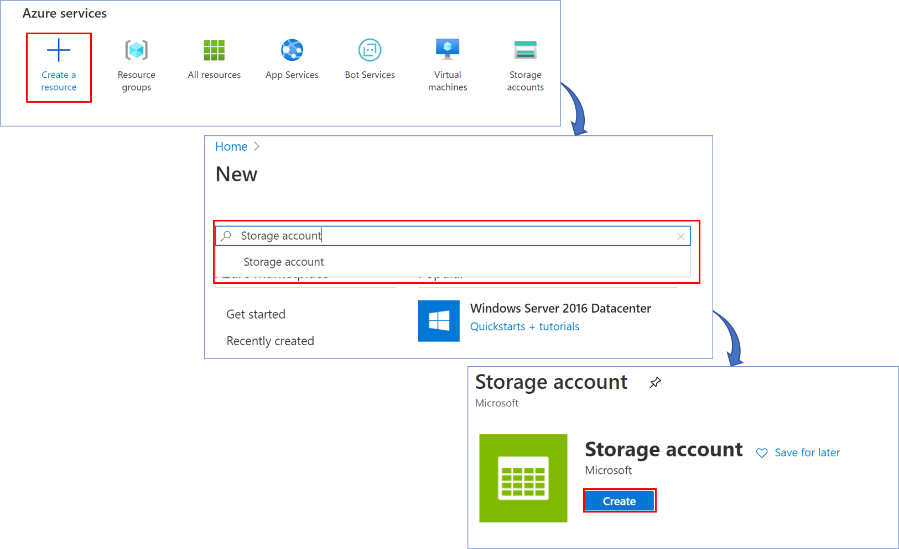
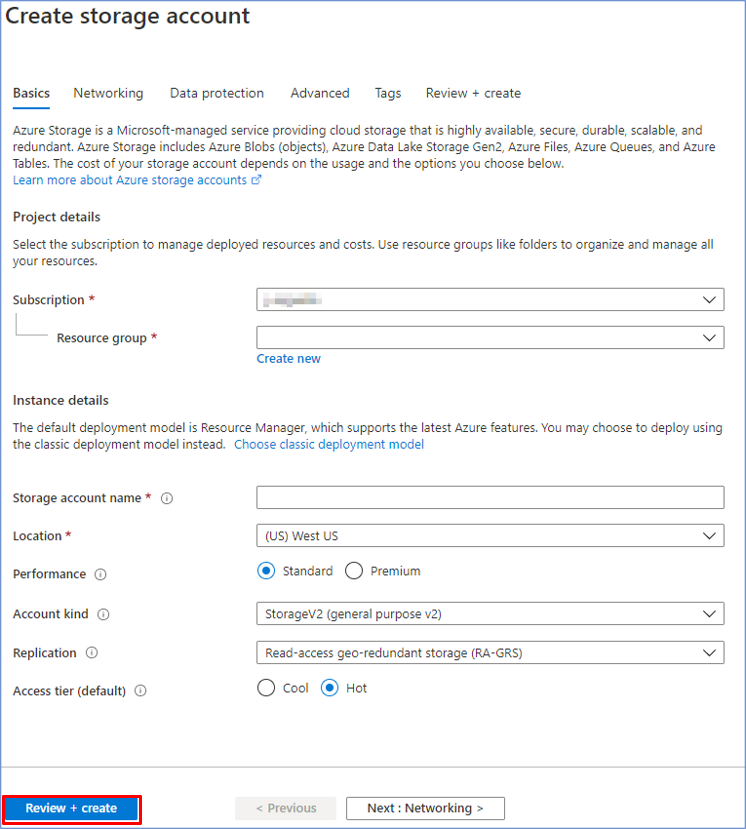
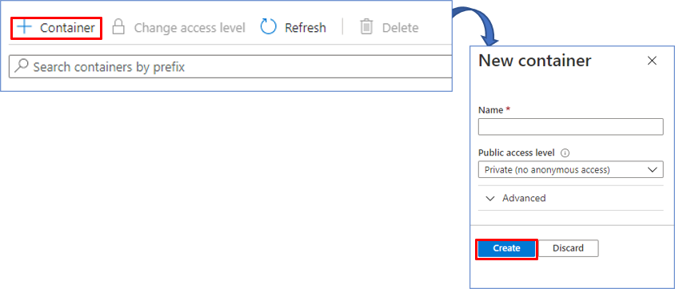
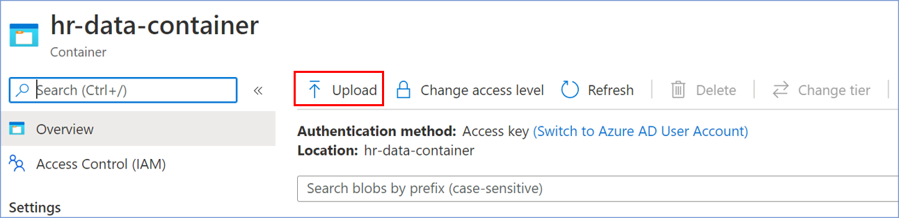
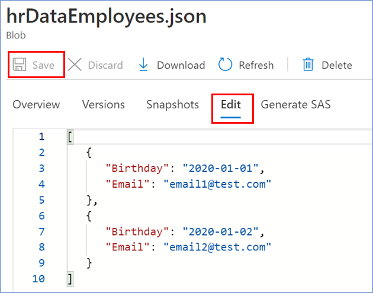

# Configure Blob storage & container
Here’s how to create an Azure Storage Account Container and a container, assuming you already have an Azure subscription and a Resource group created.
  
- In your browser, navigate to the [Azure Portal](https://portal.azure.com).
  
- Add new Storage Account into your Azure Portal

    

- We select our Resource group. We write a name for the Storage Account. Leave the default settings.
Finally, we select Review + Create to review your Storage Account settings and create the account.  

     

> When choosing the **location** for your new resource, remember to use the same region for all new resources to cut costs (it is recommended to use the location **West US**).
- After the storage account is created, you need to create **two new containers**. The first container **hr-data-container** which will have a json file where the birthday data will be saved. And finally, the **prod-conversations** connector where a file will be saved with the data of the channels where the Birthday Bot was added.
To create a new container, we click on add Container. Then enter a name, which in this case would be **hr-data-container** and select at the public access level Private and then click create. We will repeat the same process to create the container **prod-conversations**.  

     

- Finally we need to upload a file to the ** hr-data-container ** container, as follows:
     1. Download the **hrDataEmployees.json** file from this <a id="raw-url" href="https://raw.githubusercontent.com/southworks/azure-botsdk-happybirthday-bamboohr-slack-bot/update-documentation/docs/resources/hrDataEmployees.json">link</a>.
     1. From our container **hr-data-container**, click on **Upload**.  
     
     1. We **select** the file that we downloaded in step 1.
     1. To finish the upload, click on **Upload**.  
     

- To edit our file **hrDataEmployees.json** and we will load the data for the birthdays we want to add. To do this, we select our file and go to the **Edit** tab. We edit our files and click on **Save**.

     

> The added **emails** added to the **hrDataEmployees.json** file, have to be included in the Slack channel.
### Next Steps

* [Configure appsetting.json](ConfigureAppsettings.md#configure-appsetting.json)
* [Create Azure Function](AzureFunction.md#create-azure-function)

[← Back to Table of contents](README.md#table-of-contents)