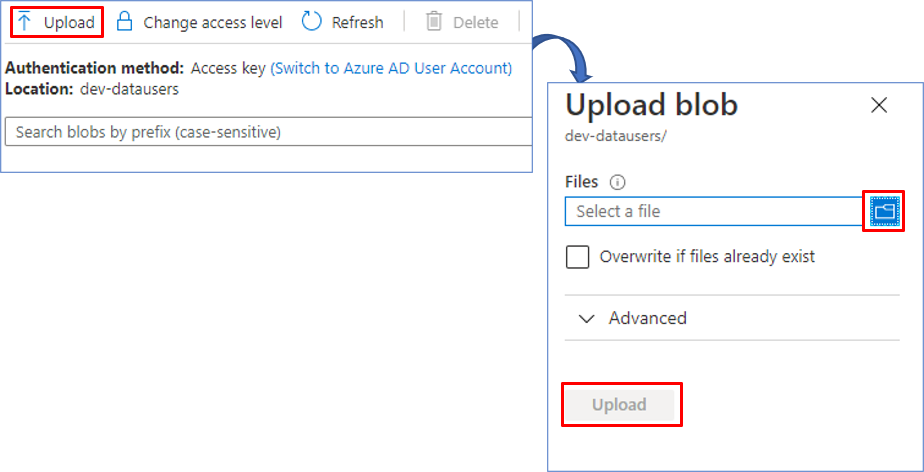

# Birthday Bot
## Configure blobstorage & container  
- In your browser, navigate to the [Azure Portal](https://portal.azure.com).
  
- Add new Storage account into your Azure Portal

    

- We select our Resource group. We write a name for the storage account. Leave the default settings.
Finally, we select Review + Create to review your storage account settings and create the account.  
     

- Once created the storage account, add a new Container. Enter a name, select in Public access level Private, and then click create.  

     

- With the container created, we will upload the corresponding JSON files. We select the file and then click Upload. We repeat the process to upload the second file.  

     

### Next Steps

* [Configure appsetting.json](ConfigureAppsettings.md#configure-appsetting.json)
* [Deploy on Azure Portal](DeployAzurePortal.md#deploy-on-azure-portal )
* [Create Azure Function](AzureFunction.md#create-azure-function)
* [BambooHR Integration](BambooHR.md#bambooHR-integration)