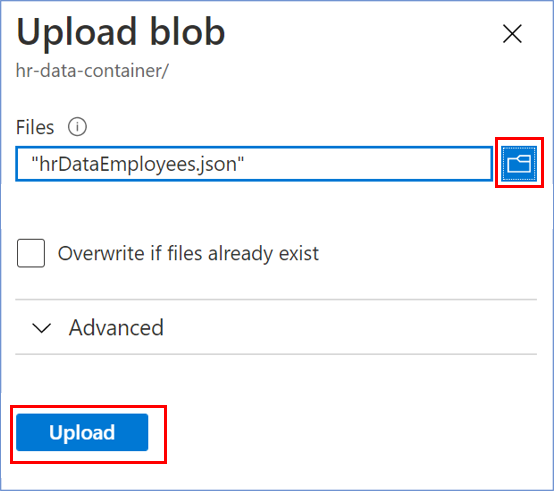

# Configure Blob storage & container
Here’s how to create an Azure Storage Account Container and a container, assuming you already have an Azure subscription and a Resource group created.
  
1. In your browser, navigate to the [Azure Portal](https://portal.azure.com).
  
1. Add new Storage Account into your Azure Portal

    

1. We select our Resource group. We write a name for the Storage Account. Leave the default settings.
Finally, we select **Review + Create** to review your Storage Account settings and create the account.  

     

     > When choosing the **location** for your new resource, remember to use the same region for all new resources to reduce costs.
1. After the storage account is created, you need to create **two new containers**:
     - **hr-data-container** - it will have a JSON file with the users' birthday data.
     - **prod-conversations** - it will have a JSON file with the Birthday Bot conversations.
  
1. To create a new container, we click on **+ Container**. Then enter a name, which in this case would be **hr-data-container** and select at the public access level Private and then click create. We will repeat the same process to create the container **prod-conversations**.  

     

1. Finally we need to upload a file to the **hr-data-container** container, as follows:

     1. Create a json file with the name of **hrDataEmployees.json** with the following content:
          ```json
          [
               {
                "Birthday": "2020-01-01",
                "Email": "email1@test.com"
               },
               {
                "Birthday": "2020-01-02",
                "Email": "email2@test.com"
               }
          ]
          ```
          > This **code snippet** is a base template of the json file where birthdays are loaded, which will be modified in a personalized way. In the parameter `Birthday` the date of birth is loaded with the format **yyyy-mm-dd**, and in the parameter `Email` the corresponding email is loaded.

     1. From our container **hr-data-container**, click on **Upload**.  
     
     1. We **select** the file that we created in step 1.
     1. To finish the upload, click on **Upload**.  
     

     - To edit our file **hrDataEmployees.json** and we will load the data for the birthdays we want to add. To do this, we select our file and go to the **Edit** tab. We edit our files and click on **Save**.

          

     > The added **emails** added to the **hrDataEmployees.json** file, have to be included in the Slack channel.
### Next Steps

* [Configure appsetting.json](ConfigureAppsettings.md#configure-appsettingsjson)
* [Republish Bot](RepublishBot.md#republish-bot)
* [Create Azure Function](AzureFunction.md#create-azure-function)

[← Back to Table of contents](README.md#table-of-contents)
