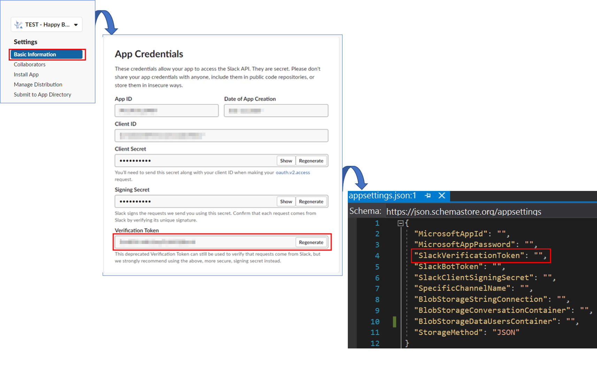

# Configure appsettings.json
Keeping settings and reading them at runtime is an essential part of any application. In this case, we need to set parameters in the **appsettings.json** file coming from Slack and Azure. Next, it will be shown how to set these parameters.

### Set Up Specific Channel

Regarding the main funcionality of the bot, **Send Happy Birthday Message**, you may set up the related **specific channel name** in the **appsettings.json** file variable **SpecificChannelName**. The channel ID is obtanined by its name to more easily specify the channel on which the bot should send the message. This channel name must be added under the SpecificChannelName parameter without the # character.

  

### Set Up Slack App

As for the connection to the slack app, the parameters (**SlackVerificationToken, SlackClientSigningSecret and SlackBotToken**) of the **appsetting.json** file of our project have to be modified.
- Browse to [Slack Api](https://api.slack.com/apps)
- Select the app you want to connect to  

- Set parameter **SlackVerificationToken**:

- Set parameter **SlackClientSigningSecret**:

- Set parameter **SlackBotToken**:
  

### Set Up Azure Blob Storage
 
As part of the configuration of the bot, we need to configure several parameters related to the **Blob Storage** in the **appsettings.json** file. The first thing is enter to our **Storage Account** from the [Azure Portal](https://portal.azure.com/). To modify the following parameters:
 
- **Connection string** into variable **BlobStorageStringConnection**, it is a connection string to the Azure Blob Storage.

- **Data User Container** into variable **BlobStorageDataUsersContainer**, it is a name to the Azure Blob Storage Container. 

- **Conversation Container** into variable **BlobStorageConversationContainer**, it is a name to the conversation data.

### Next Steps

* [Deploy to Azure](DeployAzurePortal.md#deploy-on-azure-portal )
* [Create Azure Function](AzureFunction.md#create-azure-function)

[← Back to Table of contents](README.md#table-of-contents)
