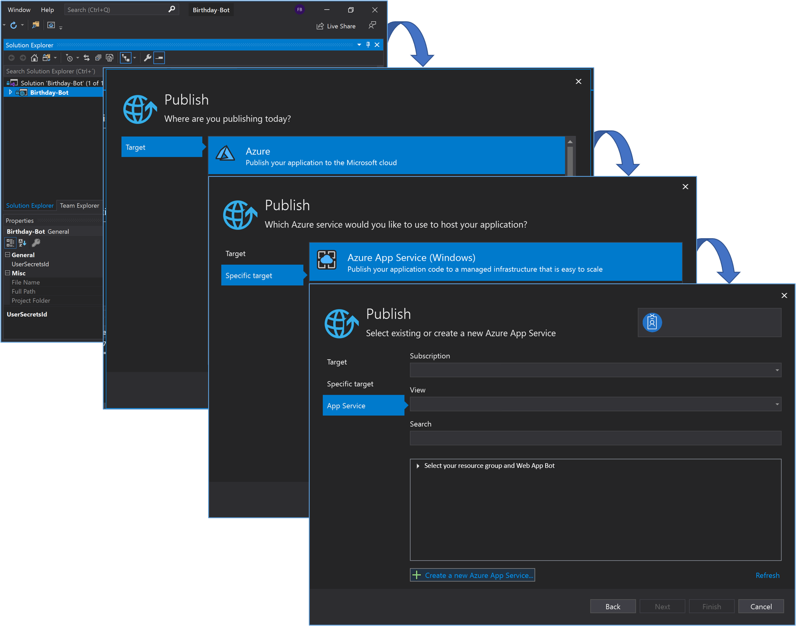

# Deploy on Azure with Visual Studio
This document explains how to deploy the bot from in Visual Studio.

1. In Solution Explorer, right-click in the project node and choose **Publish** (or use the **Build** > **Publish** menu item).
1. In the **Publish** dialog, select **Azure**.
1. Select **Azure App Service (Windows)** and **Next**.
1. Sign in with you Azure account, if necessary. Select **Create a new Azure App Service...**
1. In the **Create Azure App Service (Windows)** dialog, the **App Name, Resource Group**, and **App Service Plan** entry fields are populated. Select **Create**. When ready, select **Finish**.

### Next Steps

* [Create Azure Function](AzureFunction.md#create-azure-function)
* [BambooHR Integration](BambooHR.md#bambooHR-integration)

[← Back to Table of contents](README.md#table-of-contents)