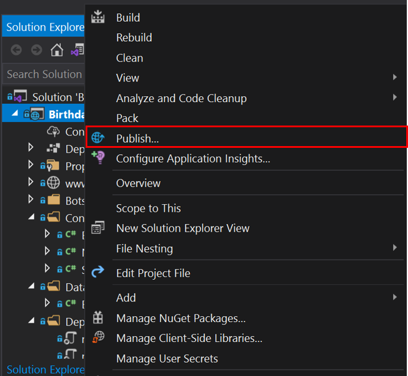
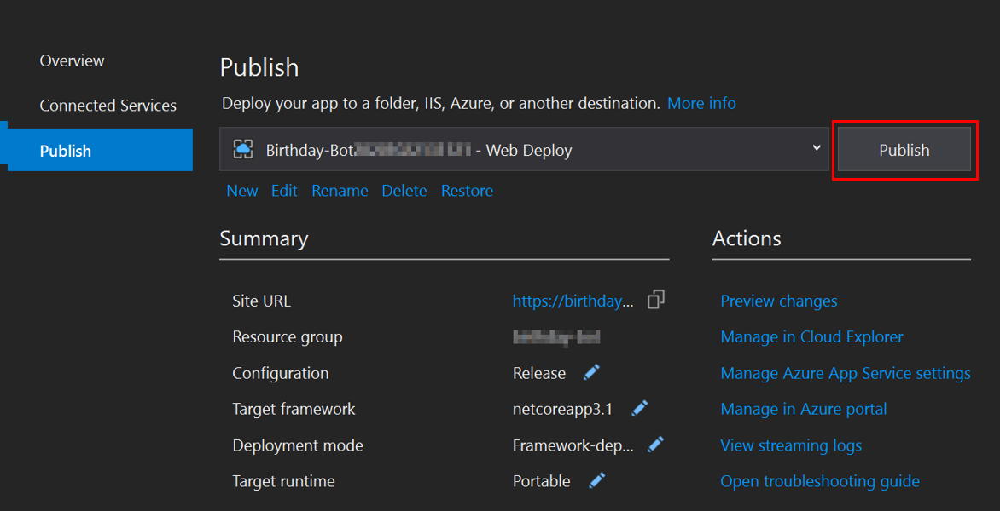

# Republish Bot
Once the parameters of the **appsettings.json** file of our Bot are complete, it is necessary to republish these changes. This document explains the two ways to republish these changes, by means of:
- Republish with Visual studio.
- Republish via CLI.  

### Prerequisites
* Have the parameters of the **appsettings.json** file configured.

## Republish with Visual studio

### Steps

1. In Solution Explorer, right-click in the project node and choose **Publish** (or use the **Build** > **Publish** menu item).

    

1. Next, a panel with project properties will be shown, verify they are correct and select **Publish**.
    

> Once the deployment is complete, we will have updated the parameters of the **appsettings.json** file in Azure.

## Republish via CLI

### Steps

1. Clone the repository into your file system:

    ```shell
    git clone https://github.com/southworks/azure-botsdk-happybirthday-bamboohr-slack-bot.git
    ```

1. Open the **Windows PowerShell**.

1. Navigate into the the folder where file `.csproj` is located.

1. First of all, execute the following command to log into the Azure Portal. This command will prompt you a browser screen in order to enter your azure credential:

    ````shell
    az login
    ````

1. Execute the following command in order to add the configuration files into the root of your local source code directory and be able to publish using `az webapp deployment`:

    ````shell
    az bot prepare-deploy --lang Csharp --proj-file-path ./
    ````
    > **More information:** [az bot prepare-deploy](https://docs.microsoft.com/en-us/cli/azure/bot?view=azure-cli-latest#az-bot-prepare-deploy)

1. Execute the following command to publish the application and its dependencies to a folder for deployment:

    ````shell
    dotnet publish -o <FOLDER-NAME>/
    ````
    > **NOTE:** Before executing this command, the `folder-name` path must exist. The `-o` command option indicates the output directory.

1. Run the following command to compress the publish files generated in the previous step:

    ````shell
    Get-ChildItem -Path "<FOLDER-NAME>" | Compress-Archive -DestinationPath <ZIP-FILE-NAME.zip> -Force
    ````
    > **NOTE:** The `Get-ChildItem` command displays the elements and children of one or more specified locations.

1. Run the following command to deploy the bot source code into the **Azure Portal** using the zip file compressed in the previous step:

    ````shell
    az webapp deployment source config-zip --resource-group "<YOUR-RESOURCE-GROUP-NAME>" --name "<YOUR-APP-SERVICE-BOT-NAME>" --src "<ZIP-FILE-NAME.zip>"
    ````
    > Once the deployment is complete, we will have updated the parameters of the **appsettings.json** file in Azure.

### Next Steps

* [Create Azure Function](AzureFunction.md#create-azure-function)


[← Back to Table of contents](README.md#table-of-contents)