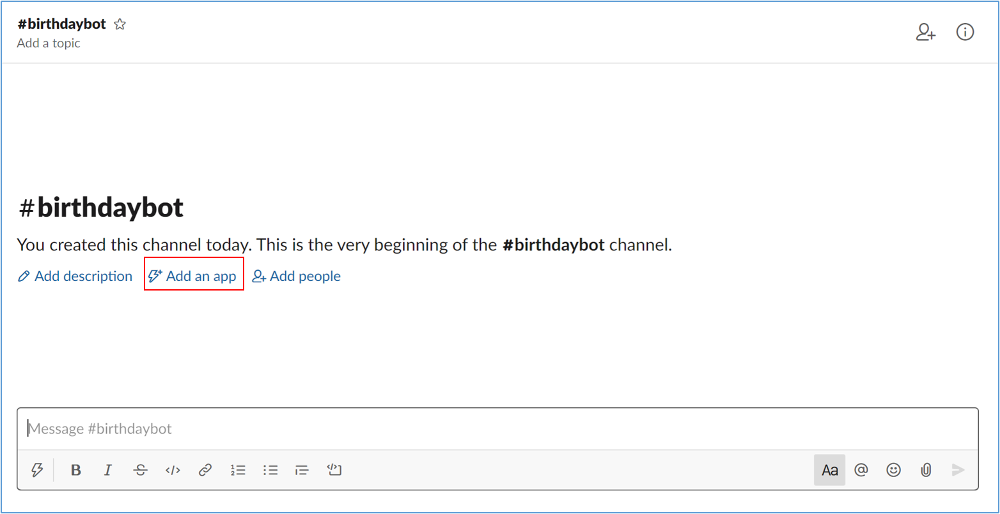

# Create Slack App
This document explains how to connect the bot with a Slack Channel.

* [Connect deployed bot with Slack Channel](https://docs.microsoft.com/en-us/azure/bot-service/bot-service-channel-connect-slack?view=azure-bot-service-4.0&tabs=abs)
* Add Slack-App to a channel

Select your channel and click on "Add an app"

### Next Steps

* [Configure blobstorage & container  ](Blobstorage&Container.md#configure-blobstorage-&-container)
* [Configure appsetting.json](ConfigureAppsettings.md#configure-appsetting.json)
* [Deploy to Azure](DeployAzurePortal.md#deploy-on-azure-portal )
* [Create Azure Function](AzureFunction.md#create-azure-function)

[← Back to Table of contents](README.md#table-of-contents)